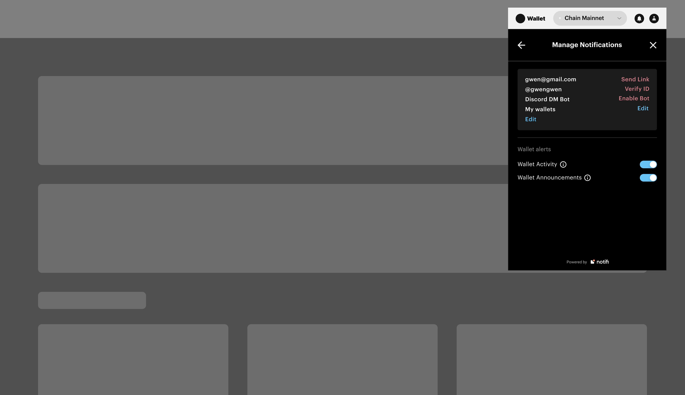

# Supporting multiple addresses 

Notifi seemless supports multiple addresses per user. This means users with multiple wallet addresses can: 

- Sign up to alerts with all their wallet adresses at the same time 
- Verify multiple wallet addresses and link them to their Notifi account
- View alert histories of their wallet addresses in one place 

This can be very useful for scenarios, where users are naturally expected to handle multiple addresses, such as: 

- Direct integrations of Notifi into browser extension wallets
- Multichain dApps where users can sign up with wallets from multiple chains 

## Example user flow

See an example user flow of a direct integration into a browser extension wallet in our [Figma](https://www.figma.com/file/ieF0Ynuc3WI608RCt7wKSf/Notifi-Template)

<!---
User clicks bell icon for the first time and has to opt in to destinations


User adds destinations, clicks next


User has to sign for hardware wallets (other wallets are already verified). Verification of wallets is needed to let users get wallet activity alerts.


If a user clicks ‘edit’ next to my wallets they are presented the screen on the left again, from which they can verify any hardware wallets. If they toggle on activity without having any verified wallets, that screen will also present.



Returning users are presented with the alert history. Settings icon opens Manage Notifications.


--->

## Integration introduction

Currently multiple addresses are only supported through our [**React Card**](https://github.com/notifi-network/notifi-sdk-ts/tree/main/packages/notifi-react-card).  

To enable support for multiple addresses use the `multiWallet: MultiWalletParams` property in `NotifiContext` when adding the React Card, which is of the following type: 

```typescript
type MultiWalletParams = Readonly<{
  ownedWallets: ReadonlyArray<WalletWithSignParams>;
}>;

type WalletWithSignParams = Readonly<{
  displayName?: string;
  walletBlockchain:
    | 'ETHEREUM'
    | 'POLYGON'
    | 'ARBITRUM'
    | 'AVALANCHE'
    | 'SOLANA'
    | 'BINANCE'
    | 'OPTIMISM';
  walletPublicKey: string;
  signMessage: Uint8SignMessageFunction;
}>
```

> **Note:** See the full definition of the type `WalletWithSignParams` [here](https://github.com/notifi-network/notifi-sdk-ts/blob/main/packages/notifi-core/lib/NotifiClient.ts)

With this adding `multiWallet` is easy, once the list of wallet addresses of the user has been obtained. 


## How to integrate

1. Obtain the list of wallet addresses 

  This will depend on the blockchain and wallet, but often a `useWallet()` hook can be used to fetch an array of all wallet addresses incl. their public keys

2. Construct `signMessage` functions for every address

  This will again depend on the blockchain you are developing for. Generally a function that takes a hashed message, signs it, and returns the signature is required. 

  <details> 
    <summary>Code example for Aptos</summary>

    ```typescript
    const { signMessage, account } = useWallet();

    const signMessageForAccount = async (address: string) => {
      return async (message: string, nonce:number) => {
        const messageBuffer = ['Aptos', 'address: ${address}', 'nonce: ${nonce}', 'message: ${message}]
        const result = await signMessage(address, messageBuffer.join('\n'));
        return result;
      }
    };
    ```
  </details>

3. Construct a `WalletWithSignParams` array with the public keys and `signMessage` functions and pass it in the `multiWallet` property of `NotifiContext`

  <details>
    <summary>Code example for Aptos</summary>

    ```typescript
    // simplified code for demonstration purposes
    const { accounts } = useWallet();

    const ownedWallets = useMemo<ReadonlyArray<WalletWithSignParams>>(
      () =>
        accounts.map((account) => ({
          walletBlockchain: "APTOS",
          signMessage: signMessageForAccount(account),
          walletPublicKey: account.publicKey,
          accountAddress: account.address,
          displayName: account.name,
        })),
      [accounts, signMessageForAccount]
    );
    ```
    
    ----

    ```typescript
    export const Notifi: React.FC = () => {
      ...
      return (
        <NotifiContext
          dappAddress="<YOUR OWN DAPP ADDRESS HERE>"
          env="Development"
          walletBlockchain="APTOS"
          accountAddress={account.address.toString()}
          walletPublicKey={account.publicKey.toString()}
          signMessage={signMessage}
          // add multiWallet here
          multiWallet={ownedWallets}
        >
          <NotifiSubscriptionCard
            cardId="<YOUR OWN CARD ID HERE>"
            inputLabels={inputLabels}
            inputSeparators={inputSeparators}
            darkMode //optional
          />
        </NotifiContext>
      );
    };
    ```
  </details>
