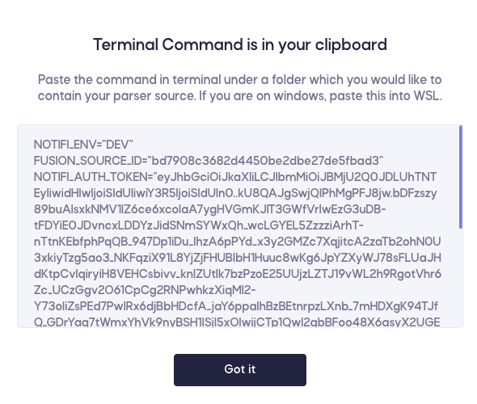
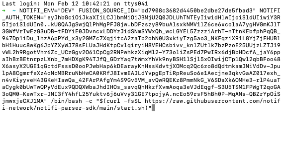
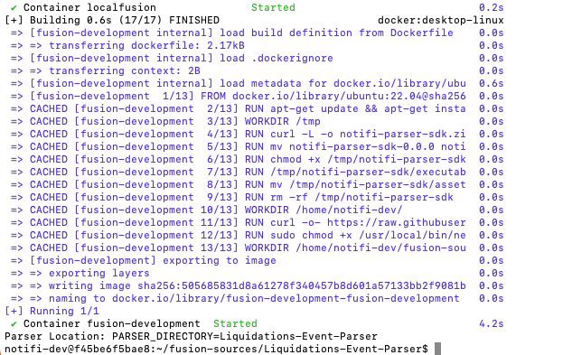
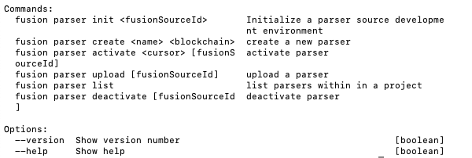
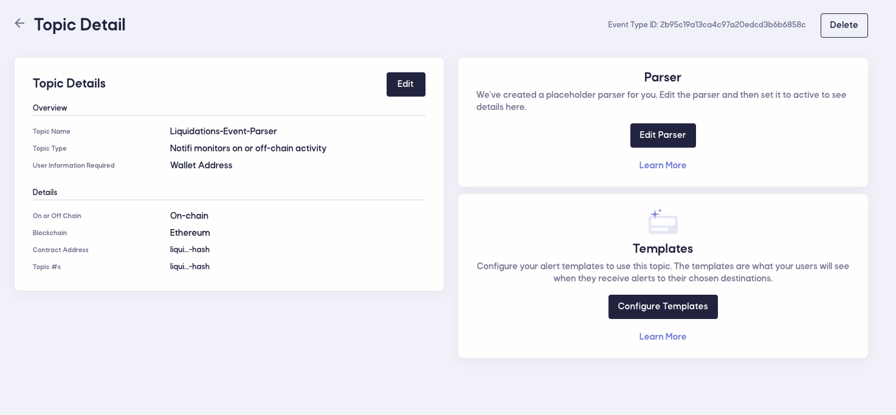

# On-Chain & Off-Chain Development

The Blockchain Development tool is intended to speed up the development process of creating [_topic_](https://notifi-network.github.io/docs/next/integration-overview/alerts-in-depth#topic) parsers for users.

**Requirements**:

- Install [Docker](https://docs.docker.com/get-docker/)
- [VS Code](https://code.visualstudio.com/download) is Recommended
- CLI supported on Mac OSX / Ubuntu Terminal
  > for Windows, paste the startup command into WSL

## Using the Blockchain Development CLI

### You'll Find The CLI Command Here

##### Important parameters:

- `NOTIFI_AUTH_TOKEN`: This token refers to a unique identity for your DAPP and JWT authentication to interact with Notifi Services
- `FUSION_SOURCE_ID`: This ID relates to the [_topic's_](https://notifi-network.github.io/docs/next/integration-overview/alerts-in-depth#topic) respective parser ID. This is particularly useful in CLI commands.

### Paste Command Into Terminal

_Copy and Paste Into Terminal_

_Expected Result_

### Common Commands

#### Authentication Commands

`fusion auth` (Creating Authentication for a user to run any [Parser Commands](http://localhost:3000/docs/next/notifi-hosted-development/on-chain-&-off-chain-development#parser-commands))

#### Parser Commands

`fusion parser --help`

> Run this command if you forget what commands are available.

`fusion parser init`

> Run this command if you forget what commands are available.

`fusion parser create`

> Run this command if you forget what commands are available.

`fusion parser activate 'cursor' 'fusionSourceId'`

> Run this command if you forget what commands are available.

> **The Fusion Activate Command must be called at least once**

`fusion parser upload 'fusionSourceId'`

> Run this command if you forget what commands are available.

`fusion parser list`

> Run this command if you forget what commands are available.

`fusion parser deactivate 'fusionSourceId'`

> Run this command if you forget what commands are available.

### Parser Development States

Templated parsers are available in the following directory:

> /DIRECTORy/PATH

When developing a parser, expected states are to be seen in the following page:

> **The Fusion Activate Command must be called at least once**

##### When Parser _Hasn't_ Been Activated

##### When Parser _Has_ Been Activated

Here, parsers can be activated and deactivated outside of the CLI.

### Recommended Steps

1. Copy and Paste the Command into your terminal
2. Run The Command
3. Create / Modify Your Parser
4. Upload Your Parser
5. Activate Your Parser
